# Next.js 15 AI Template Collection

Kattava kokoelma UI-komponentteja ja tekoälytoiminnallisuuksia, jotka on rakennettu käyttäen Next.js 15 ja suurimmaksi osaksi Vercel AI SDK:ta. Tämä template sisältää valmiita komponentteja GenAI- ja LLM-ominaisuuksien toteuttamiseen web-sovelluksissa.

## Ominaisuudet

### UI-komponentit

- Animoidut UI-komponentit Framer Motionilla
- Responsiiviset Bento Grid -layoutit
- Navigaatiopalkit ja -rakenteet
- Dark mode -tuki
- Mukautetut animaatiot ja siirtymät

### Tekoälyominaisuudet

- **Teksti & Objektien Generointi**

  - Tekstin generointi streamauksella
  - Strukturoidun datan luominen
  - Skeemapohjainen objektien generointi

- **Tekoälychatbotit**

  - Markdown-tuellinen chat-käyttöliittymä
  - Popup-assistentti UI
  - Streamatut vastaukset

- **Tekoälyagentit**

  - Function calling -toteutukset
  - Työkaluintegraatiot
  - Google-haku integraatio Geminillä

- **RAG & Haku**

  - Vektorihaku-toteutukset
  - Embedding-pohjainen haku
  - Dokumenttipohjainen chat-järjestelmä

- **Puhe & Ääni**
  - Puheen muuntaminen tekstiksi ja takaisin puheeksi
  - Automaattinen audio processing -reitti (/api/process-audio)
    - Muuntaa käyttäjän äänityksen tekstiksi (Whisper)
    - Generoi AI-vastauksen tekstiin (GPT-4)
    - Muuntaa vastauksen puheeksi (TTS)
  - Äänen prosessointi

## Teknologiat

- Next.js 15
- Vercel AI SDK 4.0
- Motion
- Tailwind CSS
- Shadcn/ui komponentit
- Supabase

## Aloitus

1. Kloonaa repositorio:

```bash
git clone https://github.com/laguagu/template-for-apps
```

2. Asenna riippuvuudet:

```bash
npm install
```

3. Luo `.env.local` tiedosto `.env.example` pohjalta ja lisää tarvittavat ympäristömuuttujat:

```bash
cp .env.example .env.local
```

4. Semanttisen haun alustus (Mikäli haluat kokeilla RAG toteuksia):

```bash

# Luo Supabase-projekti
1. Mene https://supabase.com
2. Luo uusi projekti
3. Kopioi projektin ja tietokannan URL, sekä anon key .env.local tiedostoon

# Alusta tietokanta
npm run db:generate   # Generoi migraatiot schema.ts tiedostosta
npm run db:migrate    # Suorittaa migraatiot tietokantaan

# Lisää vektorihakufunktio Supabase SQL Editorissa
1. Avaa SQL Editor Supabasessa
2. Kopioi ja suorita functions.ts tiedoston sisältö
```

5. Käynnistä kehityspalvelin:

```bash
npm run dev
```

## Projektin Rakenne

```
app/
├── actions/        # Server Actions
├── api/           # API-reitit
│   ├── chat/             # ChatBot API-reitti
│   └── process-audio/    # Äänen käsittelyn API-reitti (nauhoitus → teksti → puhe)
├── templates/      # Tekoäly- ja UI-templatetet
```

## Esimerkkikomponenttien Sijainnit

Kaikki koodi-esimerkit ja komponentit löytyvät `/app/templates` -kansiosta, paitsi bento-grid UI esimerkki, joka sijaitsee `/app/dashboard` -kansiossa.

Kansiorakenne vastaa suoraan URL-polkuja. Esimerkiksi:

- `http://localhost:3000/templates/motion` → `/app/templates/motion/page.tsx`
- `http://localhost:3000/templates/ai/chatbot` → `/app/templates/ai/chatbot/page.tsx`
- `http://localhost:3000/dashboard` → `/app/dashboard/page.tsx`

## Dokumentaatio

- Tekoälyominaisuudet käyttävät Vercel AI SDK:ta:
  - [Tekstin Generointi](https://sdk.vercel.ai/docs/ai-sdk-core/generating-text)
  - [Strukturoidun Datan Generointi](https://sdk.vercel.ai/docs/ai-sdk-core/generating-structured-data)
- Next.js reititys ja Server Actions:
  - [Reittiryhmät](https://nextjs.org/docs/app/building-your-application/routing/route-groups)
  - [Server Actions](https://nextjs.org/docs/app/building-your-application/data-fetching/server-actions-and-mutations)

# Self-Reflective RAG

This middleware implements an advanced information retrieval system that processes user questions before they reach the main GPT-4o model. The system uses GPT-4o-mini for initial analysis and GPT-4o for answer verification, combined with a BM25 re-ranking system to ensure high-quality results.

## How It Works

The process follows these steps when a user sends a message:

1. **User Interface to API**

   - User types a message in the React-based chat interface
   - Message is sent to the API route (`/api/chat/wrapped-model`)

2. **Create Search Context with GPT-4o-mini**

   - Analyzes the message to identify:
     ```json
     {
       "concepts": ["domain-specific terms"],
       "searchTerms": ["relevant search phrases"],
       "expectedInfo": ["required information elements"]
     }
     ```
   - Keeps all terms in the original query language
   - Focuses search on relevant information

3. **Information Search & Ranking**

   - Initial Search Process:
     ```text
     Search Terms & Concepts
     • Parallel search with both terms (k=5 docs per term)
     • Results merged and filtered
     • BM25 Re-rank → top 5
     • Results sorted by similarity score
     ```
   - Performs parallel document search using both concepts and search terms
   - Merges initial search results
   - Re-ranks results using BM25 algorithm
   - Sorts by vector similarity score
   - Selects top results for verification

4. **Answer Completeness Check with GPT-4o**

   - Reviews search results against expectedInfo
   - Generates coverage analysis:
     ```json
     {
       "missingInfo": [
         {
           "info": "missing topic",
           "searchTerms": ["specific search terms"]
         }
       ]
     }
     ```
   - If missing information is found:
     ```text
     Additional Search
     • k=2 docs per term
     • Results merged with initial results
     • Re-ranked using BM25
     • Sorted by similarity score
     • Final top 5 selected
     ```

5. **Final Processing**

   - Merges and sorts all search results by similarity
   - Takes top 5 most relevant documents
   - Formats context for the main model

     ```text
     <CHAT-HISTORY>
     Previous relevant messages from the conversation...
     </CHAT-HISTORY>

     <USER-QUESTION>
     How can I complete school courses flexibly while working?
     </USER-QUESTION>

     <RETRIEVED-INFORMATION>
     Use the following information to answer the question:
     1. Document about flexible courses: "Courses can be completed online..."
     2. Document about work-study balance: "Students can choose flexible schedules..."
     3. Document about learning resources: "Access to digital materials 24/7..."
     4. Document about study guidance: "Student advisors help with planning..."
     5. Document about time management: "Effective strategies for balancing studies..."
     </RETRIEVED-INFORMATION>
     ```

   - GPT-4o generates the final answer
   - Streams response back to user interface

```mermaid
flowchart TB
    %% User Input Example with Custom Design
    Users[/"Users<br>User Message:<br>'How can I complete school<br>courses flexibly while working?'"/]

    %% Main Flow
    Start((Chat UI))
    API[API Route]

    Users --> Start
    Start -->|Input| API
    API --> Mini1[GPT-4o-mini: Create Search Context]

    %% Create Search Context Output
    Mini1 -.->|Output| Schema1["{<br>'concepts': [<br>'flexible learning',<br>'online courses',<br>'work-study balance',<br>'time management'<br>],<br>'searchTerms': [<br>'complete school courses while working',<br>'flexible education options',<br>'online learning for working professionals',<br>'time management for students'<br>],<br>'expectedInfo': [<br>'types of flexible courses available',<br>'strategies for balancing work and study',<br>'resources for online learning',<br>'tips for effective time management'<br>]<br>}"]

    Mini1 --> Terms[Search Terms & Concepts]
    Terms --> VectorSearch[Vector Search]
    VectorSearch --> Search[Document Search]
    Search --> Merge1[Merge Results]
    Merge1 --> Sort1[Sort by Similarity]
    Sort1 --> Rank[BM25 Re-ranking]

    %% Show search results
    Rank -.-|Found Documents| Docs["Retrieved Documents:<br><DATA-FROM-DOCUMENT-SEARCH>"]

    %% Answer Check and Coverage Analysis
    Rank --> GPT4[GPT-4o: Answer Check]
    GPT4 -.->|Output| Schema2["{<br>'missingInfo': [<br>{<br>'info': 'strategies for balancing work and study',<br>'searchTerms': ['work study strategies', '...']<br>},<br>{<br>'info': 'tips for effective time management',<br>'searchTerms': ['time management tips', '...']<br>}<br>]<br>}"]

    GPT4 --> Decision{missingInfo = 0}
    Decision -->|No| ExtraSearch[Additional Search with missingInfo.searchTerms]
    ExtraSearch --> VectorSearch2[Vector Search]
    VectorSearch2 --> DocSearch2[Document Search]
    DocSearch2 --> Sort2[Sort by Similarity]
    Sort2 --> Rank2[BM25 Re-ranking]
    Rank2 --> Merge2[Merge Results]
    Decision -->|Yes| Context[Prepare Context]
    Merge2 --> FinalSort[Sort by Similarity]
    FinalSort --> Top5[Select Top 5]
    Top5 --> Context

    %% Final Processing
    Context -.->|Output| FinalCtx["Context Format:<br><CHAT-HISTORY><br>Previous messages...<br></CHAT-HISTORY><br><br><USER-QUESTION><br>How can I complete courses flexibly?<br></USER-QUESTION><br><br><RETRIEVED-INFORMATION><br>Use the following information to answer:<br>1. Document about flexible courses...<br>2. Document about work-study balance...<br>3. Document about learning resources...<br>4. Document about study guidance...<br>5. Document about time management...<br></RETRIEVED-INFORMATION>"]

    Context --> GPT4o[GPT-4o]
    GPT4o --> Response[Final Answer]
    Response --> Start

    %% Styles
    classDef user fill:#90EE90,stroke:#333,stroke-width:2px
    classDef mini fill:#a8d1f0,stroke:#333,stroke-width:2px
    classDef gpt4 fill:#DDA0DD,stroke:#333,stroke-width:2px
    classDef api fill:#DDA0DD,stroke:#333
    classDef process fill:#DDA0DD,stroke:#333
    classDef db fill:#FFE4B5,stroke:#333
    classDef decision fill:#FFB6C1,stroke:#333
    classDef start fill:#90EE90,stroke:#333,stroke-width:2px
    classDef schema fill:#f5f5f5,stroke:#666,stroke-dasharray: 5 5
    classDef output fill:#E6E6FA,stroke:#666,stroke-dasharray: 5 5
    classDef vector fill:#87CEEB,stroke:#333,stroke-width:2px
    classDef sort fill:#98FB98,stroke:#333,stroke-width:2px

    class Users,Start,Response user
    class Mini1 mini
    class GPT4,GPT4o gpt4
    class API api
    class Search,DocSearch2 db
    class Terms,Merge1,Rank,ExtraSearch,Rank2,Merge2,Context process
    class Decision decision
    class Schema1,Schema2 schema
    class FinalCtx output
    class VectorSearch,VectorSearch2 vector
    class Sort1,Sort2,FinalSort,Top5 sort
```



## Key Components

### BM25 Re-ranking Process

```text
Document Search & Ranking:
-------------------------
Initial Search:
• k=5 docs per search term
• Parallel search with concepts and terms
• BM25 re-ranks top 5 results
• Results sorted by vector similarity

Additional Search (if needed):
• k=2 docs per missing term
• Results merged with initial search
• BM25 re-ranks combined results
• Final sorting by similarity score
• Top 5 most relevant documents selected
```

### GPT Models Usage

- **GPT-4o-mini:** Initial Create Search Context
- **GPT-4o:**
  - Answer completeness verification
  - Final response generation

### Document Processing

- Initial document search with broad terms
- Additional targeted searches based on missing information
- Multiple ranking phases:
  1. Vector similarity search
  2. BM25 re-ranking
  3. Final similarity score sorting
- Results merged and sorted by similarity score
- Final context includes top 5 most relevant documents

## Technical Implementation

The middleware uses these core functions:

- `createSearchContext`: Analyzes queries using GPT-4o-mini
- `multiSearch`: Handles parallel document searching and BM25 ranking
- `analyzeResults`: Verifies answer completeness using GPT-4o
- `enhancedRAG`: Orchestrates the entire process

Each function maintains the original query language throughout the pipeline and ensures results are properly ranked by relevance.

## Vector Similarity Details

The system uses cosine similarity for vector comparisons:

- Similarity score range: [-1, 1]
- Higher scores indicate greater relevance
- Results are always sorted by similarity score before final selection
- Threshold can be adjusted in the search function

## License

MIT
